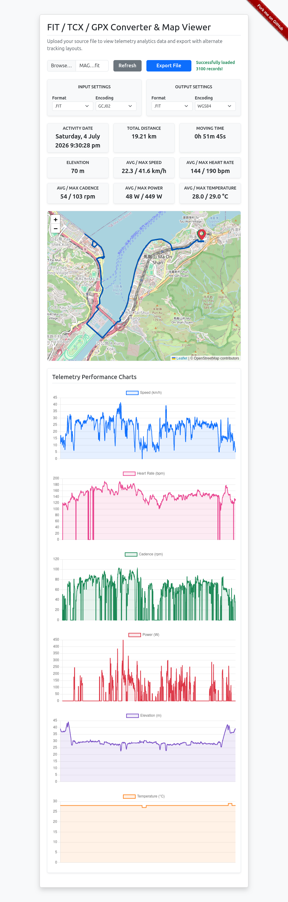

# FIT / TCX / GPX Converter & Map Viewer

Version: 20260810.1.4

[](https://github.com/hswong3i/gcj02fit-to-wgs84gpx/actions/workflows/deploy.yml)
[](https://opensource.org/licenses/Apache-2.0)
[](https://www.w3.org/WAI/WCAG22/quickref/)
[](https://owasp.org/www-project-top-ten/)

A client-side web application designed to convert and visualize activity data from `.FIT`, `.TCX`, and `.GPX` files, supporting various geospatial encodings.

## Features

- **Multi-directional File Conversion:** Convert between `.FIT`, `.TCX`, and `.GPX` formats.
- **Geospatial Encoding Support:** Convert between GCJ02, BD09, and WGS84 GPS encodings.
- **Live Preview:** Visualize telemetry data with an interactive map and line graphs before export.
- **Progressive Web App (PWA):** Installable to home screens on iOS and Android for quick access and offline capabilities.
- **Robust Standards Compliance:** Adheres to Drupal 11 JavaScript/CSS Coding Standards, WCAG 2.2 AA Accessibility, and OWASP Top 10 Security Guidelines.

## Why?

Since recent Magene C606 / C706 firmware upgrade:

- GPS data encoded into GCJ02 for Hong Kong
- But Strava expecting GPS data encoded with standard WGS84 format
- Magene also remove the auto sync and upload .FIT (with auto GCJ02 to WGS84 fixes) files to Strava

Well~ Don't Wait, Just Fix It!

## Running Locally

To set up and run a local copy of the application:

1.  **Clone the repository:**

    ``` bash
    git clone https://github.com/hswong3i/gcj02fit-to-wgs84gpx.git
    cd gcj02fit-to-wgs84gpx
    ```

2.  **Install dependencies:**

    ``` bash
    npm install
    ```

3.  **Build the project (linting, formatting, compiling):**

    ``` bash
    npm run build
    ```

4.  **Start a local server:**

    ``` bash
    npm run http-server
    ```

    Access the application in your browser at <http://0.0.0.0:8000/>

## Usage

1.  **Upload Source File:** Select your `.FIT`, `.TCX`, or `.GPX` file and its original encoding.
2.  **Preview Data:** View activity summary, map track, and telemetry charts.
3.  **Convert & Export:** Choose your desired output format and encoding, then click "Export File" to download the converted data.

## Demo Layout



## License

- Code released under [Apache License 2.0](LICENSE)
- Docs released under [CC BY 4.0](http://creativecommons.org/licenses/by/4.0/)

## Author Information

- Wong Hoi Sing Edison
  - [Twitter](https://twitter.com/hswong3i)
  - [GitHub](https://github.com/hswong3i)
